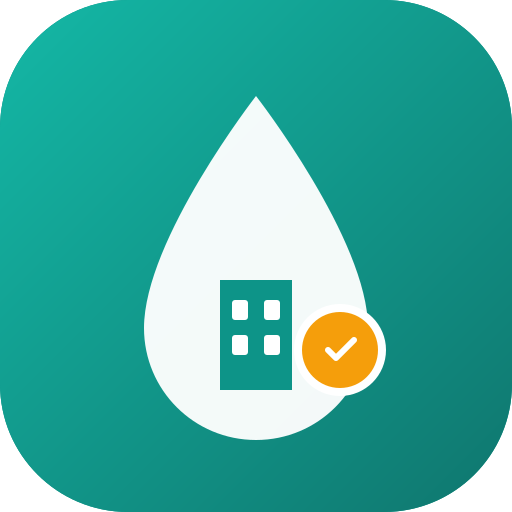

# Sewerage Collection PWA (Ajman, UAE) 🇦🇪

[](https://ahmadok12.github.io/Severage-Collection-App/)

👉 **Live Demo**: [https://ahmadok12.github.io/Severage-Collection-App/](https://ahmadok12.github.io/Severage-Collection-App/)

A modern, mobile-first Progressive Web App (PWA) tailored for landlords and property managers in Ajman, UAE to manage monthly sewerage fee collections, issue digital payment vouchers, send manual WhatsApp reminders, and track tenant recovery ledgers (Debit, Credit, and Balance style).



---

## ✨ Features

- **Mobile-First Light UI**: Apple-inspired clean aesthetic with translucent navigation, minimal text, bold AED figures, and live status pills (`Paid`, `Partial`, `Due`, `Overdue`).
- **Partial Payment Handling**: Real-time computation of partial payments and remaining pending amounts. Units track Billed, Paid, and Remaining Balance.
- **Tenant Recovery Statement (Reports Tab)**: Accounting ledger format showing Date, Description, Reference, Debit (Dr), Credit (Cr), and Running Balance for individual tenants as well as the entire portfolio.
- **1-Tap Manual WhatsApp Reminders**: Direct `wa.me` links pre-filled with tenant name, flat number, billing month, and outstanding balance without requiring API subscriptions.
- **Digital Payment Vouchers**:
  - Official format including ASPCL (Ajman Sewerage) Master Account and Tasdeeq contract numbers.
  - 5% UAE VAT breakdown.
  - Distinct digital stamps for `PARTIAL PAID` and `PAID IN FULL`.
  - Export options: Download as PNG image, Print/Save PDF, and WhatsApp share.
- **PWA & Offline Ready**: Service Worker (`sw.js`) and `manifest.json` enable home-screen installation on iOS and Android devices.
- **Data Backup**: Local storage sync with one-click JSON Export & Import.

---

## 🛠️ Tech Stack

- **Framework**: React 19 + Vite
- **Styling**: Tailwind CSS v4
- **Icons**: Lucide React
- **Voucher Rendering**: HTML2Canvas

---

## 🚀 Getting Started

### Prerequisites
- Node.js (v18+)
- npm or yarn

### Installation

```bash
# Clone the repository
git clone https://github.com/ahmadok12/Severage-Collection-App.git

# Navigate to project directory
cd Severage-Collection-App

# Install dependencies
npm install

# Start development server
npm run dev
```

Open [http://localhost:3000](http://localhost:3000) in your browser.

### Build for Production

```bash
npm run build
```

---

## 📄 License
MIT License
